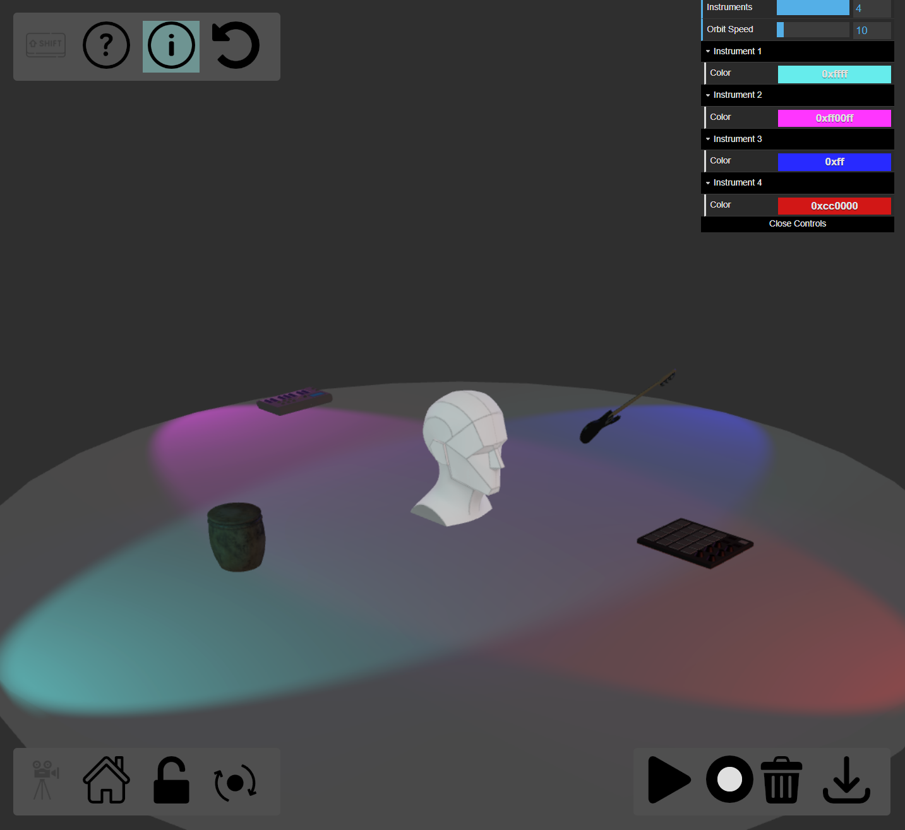

## 3DStage



#### Installation
To run the vizualization, you will need to install node and npm. Follow installation instructions for your OS.
<br>
https://nodejs.org/en
<br>
https://www.npmjs.com/
<br>
Once installed, open the project to the directory where you see index.html and use npm to install three.js and vite
```
npm install --save three
npm install --save-dev vite
```

Run one last install to get the final dependency:

```
npx install
```
Run the project with this command:

```
npx vite
```

Then, it should give you a localhost URL to open. 

<br>
Audio coming soon!

#### Resources
three.js
https://threejs.org/examples
<br>

Web Audio API
https://mdn.github.io/webaudio-examples/
<br>

