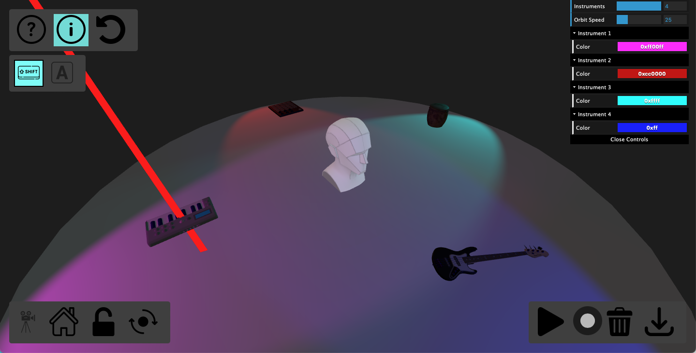

## 3DStage



#### About
3D Stage is an audio-visual music creation tool, build with three.js and the Web Audio API. It features stereo spatialized audio, customizable colors, and audio recording. You can even drop your own audio files in to spatialize and modify them!
<br>
You can see a demo video here: 
<br>
<iframe src="https://drive.google.com/file/d/1xTrySzJaFrVCRjIFpE2OyHvV5XpGrmlW/preview" width="640" height="480" allow="autoplay"></iframe>

#### Installation
To run the vizualization, you will need to install node and npm. Follow installation instructions for your OS.
<br>
https://nodejs.org/en
<br>
https://www.npmjs.com/
<br>
Once installed, open the project to the directory where you see index.html and use npm to install three.js and vite
```
npm install --save three
npm install --save-dev vite
```

Run one last install to get the final dependency:

```
npm install
```
Run the project with this command:

```
npx vite
```

That will run the development server, which should give you a localhost URL to open. 

Detailed instructions can be found in the information menu, which you can see by clicking the flashing ℹ️ icon.

#### Building

To build this application for deployment, run this command:
```
npx vite build
```
That will output static site content the 'docs' folder. (Which in this repo is where GitHub pages looks for it.)
#### Resources
three.js
https://threejs.org/examples
<br>

Web Audio API
https://mdn.github.io/webaudio-examples/
<br>
